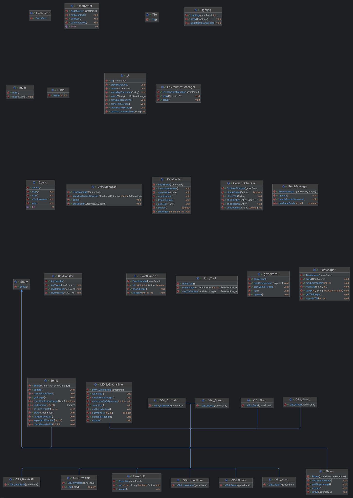

# bombermanUET

---

## Thành viên
**Nhóm 12**

- Lê Trung Đức - 24022293
- Bùi Tiến Dũng - 24022299
- Nguyễn Việt Hà - 24022371

---

## Cốt truyện
Thái tử Leduc của vương triều Dubai, mang thiên mệnh cao cả, bị hút vào một linh trận cổ xưa, hồn xuyên đến dị giới tu 
tiên nơi yêu tà hoành hành và trời đất đảo điên. Không mang kiếm hay pháp bảo như các tu sĩ thường thấy, hắn chỉ có Lôi 
Đạn Linh Cấm — loại bom thượng cổ có thể cảm ứng thiên cơ, đủ sức diệt quỷ tru tiên.

Được giao sứ mệnh giải cứu Công chúa Israel — thánh nữ cuối cùng mang huyết mạch Thần Tộc — Leduc bước vào hành trình 
huyết lệ: phá cấm địa, tru yêu hoàng, đánh đổi linh hồn lẫn thân xác. Sau cùng, hắn tiến vào Ma Vực Cấm Địa và đối mặt 
một sinh vật có cánh trắng, tà lẫn thánh.

Không chút do dự, Leduc kích nổ toàn bộ linh đạn, tự thiêu linh thể để xóa sổ sinh vật kia. Nhưng trong đống tro tàn, 
không có Công chúa — chỉ một cánh cổng đá khắc chữ "Luân Hồi Vô Tận" lặng lẽ mở ra.

Hắn bước vào, linh hồn tan vỡ, hy vọng lụi tàn. Thế giới quay vòng.

Khi mở mắt lại giữa bão cát ngày đầu, hắn không còn nhớ gì, nhưng nỗi đau mất mát vẫn âm ỉ trong tim.

Luân hồi lặp lại.

Chỉ có nàng là không thể trở về.
Chết dưới chính tay hắn.

---

## Giới thiệu
Bomberman là một trò chơi điện tử cổ điển, nổi tiếng với lối chơi đơn giản, nơi người chơi điều khiển một nhân vật đặt 
bom để phá hủy chướng ngại vật, tiêu diệt kẻ thù và mở đường đến chiến thắng, tựa game này được nhóm mình miêu tả lại và
được pha trộn thêm vài yếu tố dạng hầm ngục.

-  Bomber là nhân vật chính của trò chơi. có thể di chuyển theo 4 hướng cơ bản và được cố định có 1 máu.
- Ngăn cản người chơi đến với chiến thắng là các monster, chúng sẽ đuổi theo truy đuổi nhân vật bằng mọi cách.
-  Bomb là vũ khí duy nhất người chơi có thể gây sát thương lên quái. Bom chỉ có thể đặt tại các ô grass. Khi
kích hoạt Bomber và quái không thể di chuyển vào vị trí quả bomb (Sau khi đặt bom người chơi sẽ có 1 lần được đi ra khỏi
vị trí quả bom sang bên cạnh). Bom sẽ được đặt ngay tại vị trí chính giữa ô gần nhất với người chơi, sau 3s bom sẽ phát
nổ theo 4 hướng với các Flame (ảnh Flame) đi cùng.
-  Grass Là nền tảng cơ bản trong bản đồ, Grass cho phép các đối tượng như Bomber và Enemy tự do di chuyển
qua. Người chơi cũng có thể đặt Bomb trực tiếp lên ô Grass mà không bị giới hạn.
-  Wall là chướng ngại vật cố định, không thể bị phá hủy bởi Bomb và cũng không cho phép đặt Bomb lên trên.
Cả Bomber lẫn Enemy đều không thể di chuyển xuyên qua hoặc đứng lên ô chứa Wall.
-  Brick được đặt trên nền Grass và đóng vai trò như một chướng ngại tạm thời. Người chơi không thể đặt
Bomb trực tiếp lên Brick, và nó ngăn cản việc di chuyển của cả Bomber lẫn Enemy. Tuy nhiên, Brick có thể bị phá hủy nếu
trúng bom phát nổ gần đó, sau khi phá vỡ Brick sẽ được thay bằng Grass hoặc có thể rơi các vật phẩm ẩn bên dưới. 
-  Door là vật thể có thể đưa bạn sang level mới, Bomber không thể mở nó nếu không có Key, nhiệm vụ chính của 
người chơi là tìm kiếm Key được phân bố ngẫu nhiên trên bản đồ để mở Door và hoàn thành màn chơi.
-  Key có chức năng duy nhất là mở cánh cửa, Bomber có thể giữ nhiều key 1 lúc, nhưng mỗi lần chỉ sử dụng
một chiếc để mở cửa. Key thường được giấu kỹ hoặc đặt ở những vị trí thử thách, buộc người chơi phải khám phá toàn bộ
bản đồ.

---

## UML diagram

---

## Cài đặt

1. Sao chép (clone) dự án từ kho lưu trữ (repository).
2. Mở dự án bằng IDE (môi trường phát triển tích hợp) mà bạn sử dụng.
3. Chạy dự án.
4. Nếu bạn muốn thay đổi dữ liệu, hãy chỉnh sửa các tệp `E_V.txt` và `V_E.txt`.

---

## Gameplay

Trong mỗi màn chơi, người chơi sẽ điều khiển nhân vật Bomber di chuyển trên bản đồ dạng lưới, với khả năng đặt và
kích hoạt Bomb để phá hủy chướng ngại vật và tiêu diệt kẻ thù.

- Mục tiêu chính của người chơi là:  
        Tiêu diệt toàn bộ Enemy xuất hiện trong màn chơi.  
        Tìm và mở Portal (cổng dịch chuyển)

- Bomber sẽ bị mất máu khi chạm vào quái hoặc bị dính lửa từ quả bóm của chính mình.
- Enemy sẽ bị tiêu diệt khi chạm vào lửa của người chơi.
- Sẽ có màn có hiệu ứng ánh sáng đặc biệt yêu cầu người chơi phải có kỹ năng cao.

Trong quá trình chơi, sẽ có 1 tỷ lệ nhất định người chơi có thể tìm thấy Item ẩn phía sau các khối Brick sau khi phá hủy
hoặc sau khi tiêu diệt các monster, Bomber có thể sử dụng Item bằng cách di chuyển vào vị trí của Item đó. Mỗi Item
mang đến một khả năng tăng cường giúp người chơi vượt qua màn chơi dễ dàng hơn. Một số loại Item tiêu biểu:

-  Item giúp Bomber đặt được thêm 1 quả bom.
-  Item giúp bomb có thể phá tất cả tường nằm trong phạm vi.
-  Tăng độ dài lửa của quả bom thêm 1 ô (Tối đa 6 ô).
-  Hồi 1 máu cho người chơi.
-  Tăng tốc cho người chơi.
-  Item cho phép người chơi có thể đi xuyên vật thể trong 5s

Các Enemy trong trò chơi được thiết kế như:
-  Slime
-  Nấm đỏ

---

## Đóng góp

Đây là dự án đầu tay của sinh viên năm nhất.  
Trong quá trình phát triển, nếu có bất kỳ sai sót nào hoặc có ý kiến đóng góp, vui lòng liên hệ qua email:
**vha7244@gmail.com**

---

## Trạng thái dự án
Dự án đã hoàn thành.

---

## Ghi chú
Ứng dụng được viết với mục đích phục vụ học tập.    